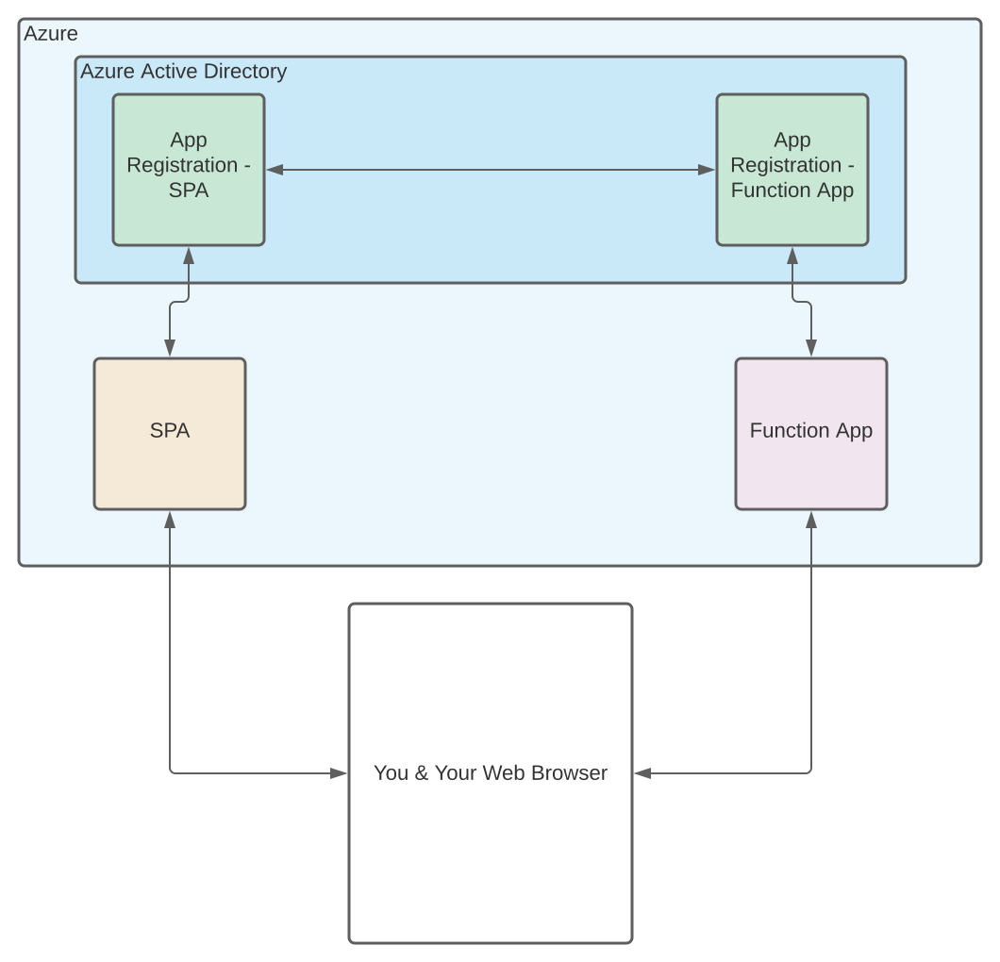
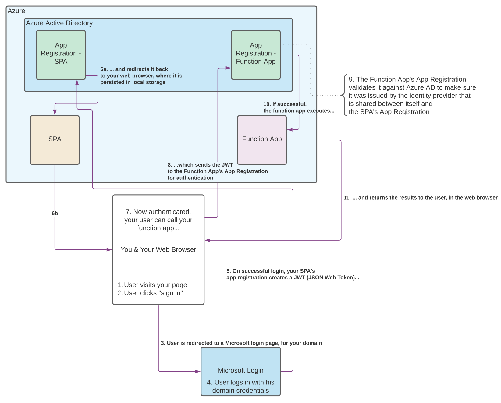

# HOW-TO: Use Azure AD to authenticate to a SPA that calls a Function App

By the end of this guide, you will be able to:

* Create a Javascript single-page app
* That uses a HTTP-triggered Function App as an API layer
* Both of which are secured through your domain login in Azure Active Directory
* On the Microsoft Azure platform
* And maybe understand what you've just done.

These things would seem to not be very difficult; and they are not difficult, but it is __very important__ that you take extra-special care to fllow these instructions _exactly as they are written_.

I have gone through great pains to understand this small body of knowledge well enough to write about it here; my wish is to circumnavigate that painful element for anyone who comes after me, who should wish to understand it as I do.

Special thanks to [Janne Hansen's great blog post](https://jannehansen.com/call-aad-functions-from-spa/) that demystified much of this for me. I copied some of his code outright for the frontend sample, and heavily referenced his work while learning about these things. The difference between Janne and myself, is that he is a cloud solution architect at Microsoft; I have been using Azure in earnest for about four days. My guide here is an extension of his, that presumes very little prior understanding of Azure, and takes great pains to explicitly guide the reader around footguns that I experienced due to my own lack of experience and context.

So let's begin.

## A brief overview

Here's a simplified diagram that shows the components that you are going to create, their relationships, and where they live in Azure:

So at first glance, this is pretty simple:

* The SPA is a simple Azure Static Site that uses an `index.html` file to host some Javascript
* The Function App is a HTTP-triggered Function App that acts as an API for your application
* Your web browser loads the SPA and makes requests to the Function App API to run your functions

However, if you want to use Azure Active Directory (referred to henceforth as "Azure AD") to authenticate users, you need to create __App Registrations__. App Registrations allow you to _register_ your _app_ with the Microsoft Identity Platform. Plainly stated, this means that you can configure your app to restrict access to users that have identified themselves as a member of your Active Directory domain. You can also integrate with MSAL.js, Microsoft's Javascript library for authentication, to get an authorization token that allows you to communicate with your apps via HTTP.

With these concepts introduced, we can look at a more complex flow diagram:

This probably looks complicated. It's really not. From 30,000 feet, all of those flow steps are experienced user-side like this:

1. User visits your page and clicks "Sign In"
1. User is redirected to sign in with his Azure AD domain credentials
1. User is redirected back to your page, with a JWT that's saved into local storage
1. All of user's requests to your function app are authenticated with the JWT that he got from signing in

## Getting started

This repo comes with batteries included; all you have to do is snap everything together. To explain these concepts, I've followed the path of least resistance to get a minimum-viable example up and running. If you want to template out your manifests or use Azure CI/CD pipelines or whatever, that's fine, but follow this guide _first_ - then if things go wrong, you'll have a better understanding of what's happening here so that you know where to look.

To follow this guide, you will need:

* A Microsoft Azure subscription
	* NOTE: At time of writing, you can't integrate with Azure AD with a "free tier" subscription
* Visual Studio 2019 with the Azure workload
* Any text editor
* A Github account and a Git client

### Legend

* Navigate: A -> B -> C means, "click through the prompts in the Azure Portal in this order"
* __Bold__ means, "click the control with this label"
* `monospaced text` means, "this is the value you should enter into the field"

## Step 0: Fork this repo

Start by forking this repo on Github. It contains the minimum-viable frontend code that you'll need to update with your configuration values.

## Step 1: Create and deploy a new Azure Static App

The `frontend` folder in this Github repo contains the skeleton of a SPA that is wired in to [MSAL.js 2.0](https://docs.microsoft.com/en-us/azure/active-directory/develop/msal-js-initializing-client-applications), with functions created to manage login and function app execution. The skeleton can run, now; the auth stuff won't work, but the skeleton is ready to be deployed.

### Create a resource group for your assets

While not strictly necessary - you can re-use an existing resource group if you have one - making a new resource group will allow you to delete all of your demo assets when you're done with them. If you don't create a new resource group, _make sure that all of the resources you create in Azure are in the same resource group!_.

On the Azure portal:

* Navigate: Resource groups
	* __Create__
		1. Subscription: Select your subscription
		1. Resource group: `spaFunctionAppADAuthGuide`
		1. Region: Select a region that's close to you. I picked `(US) East US`.
		1. __Review + create__
		1. __Create__

### Create a new Static Web App

Next, you will create an Azure Static Web App to host your `index.html` and Javascript code from the `frontend` folder on your Github fork.

On the Azure portal:

1. Navigate: Static Web Apps
	* __Create__
		1. Subscription: Select your subscription
		1. Resource group: `spaFunctionAppADAuthGuide`
		1. Name: `frontend`
		1. Plan type: `Standard`
			* Note: Free tier isn't eligible for Azure AD login
		1. Region for Azure Functions API and staging environments: Select a region that's close to you. I picked `East US 2`.
		1. Source: `GitHub`
		1. __Sign in with GitHub__
			1. When prompted, __Authorize Azure-App-Service-Static-Web-Apps__, input your password, etc
		1. Organization: Select the organization that contains your fork of this repo - I selected `jmpavlick`
		1. Repository: Select your fork - I selected `SpaFunctionAppADAuthGuide-Fork`
		1. Branch: `master`
		1. Build Presets: `Custom`
		1. App location: `/frontend`
		1. Api location: Leave blank
		1. Output location: Leave blank
		1. __Review + create__
		1. __Create__
1. You'll be redirected to a page that says "Your deployment is complete". Click __Go to resource__
1. Open a new browser tab. Navigate to your fork in Github, and click __Actions__. You'll be able to see the Github Actions CI run that was triggered by your creating the Static Web App in Azure. Every time you push to `master`, Github Actions will re-deploy the contents of your `frontend` folder to your `frontend` Static Web App.
1. Once it turns green, go back to your Azure Portal tab. You should see the overview for your `frontend` resource.
1. Click on the URL in the `url` field - mine is `https://wonderful-mud-0fb8a610f.azurestaticapps.net/`.
	* You should see your `index.html` page, live on the Internet!

### Check your progress

Before moving on to the next step, every statement on the following list should be true:

1. You forked this repo on Github
1. You created a new resource group in Azure (or chose to use an existing one)
1. You created a Static Web App inside of your resource group, called `frontend`
1. You deployed the `frontend` folder of your Github fork to your Azure Static Web App
1. You can reach it in your browser via its address displayed in the Azure portal

## Step 2: Create and deploy a new Azure Function App

If you haven't cloned your fork yet locally, now would be a great time to do that. If you have - make sure to run `git pull origin master` before continuing; in the last step, when you linked the Github repo to the Azure Static Web App, Azure created a YAML file in the repo at `.github/workflows` that tells Github Actions what files to deploy to your Static Web App every time you deploy.

I know that the "cool" way to do Function App development is to use VSCode and a whole slew of plugins. For simplicity's sake, I chose to just use Visual Studio 2019 for this portion of the guide.

In this section, we're going to create a simple "Hello World" HTTP-triggered Azure Function App that responds to a HTTP GET request. Open Visual Studio and let's get started.

1. __Create a new project__
1. In the "Search for templates" box, search for the `Azure Functions` template; whenit comes up in the list, select it and click __Next__
	1. Project name: `backend`
	1. Location: `path\to\your\fork\` - mine is `C:\Users\john\src\SpaFunctionAppADAuthGuide-Fork\`
	1. Solution name: `backend`
	1. Place solution and project in the same directory: Leave unchecked
	1. __Create__
		1. Set the .NET version to `.NET Core 3 (LTS)` (this is the default on my computer)
		1. Select `Http trigger` from the list
		1. Storage account: `Storage emulator`
		1. Authorization level: `Anonymous`
		1. __Create__
1. Awesome. You should be redirected to the main Visual Studio view, with `Function1.cs` open in the editor.
1. In the Solution Explorer, right-click `backend` and click `Publish`
	1. Select `Azure`
	1. __Next__
	1. Select `Azure Funciton App (Linux)` (it's cheaper!)
	1. __Next__
	1. Subscription name: Select your subscription
	1. Click the green __+__ icon above the Function Apps window to create a new Function App in Azure
		1. Name: Function app names have to be unique _within Azure_; I'm calling mine `backend-jmp`.
			* Moving forward, I'm going to refer to my Function App as `backend-jmp`; it might be a good idea to do a find-and-replace in this document on your fork, and replace `backend-jmp` with whatever you call your app! Commit, push, and just keep following this readme from your fork's Github page.
			* I know it may sound silly, but it always bugs me when I'm following a guide and I have to mentally substitute my asset name for the asset name in front of me. It's a whole class of typos and misconfigurations that can be completely avoided if you use the same name as the author of the guide.
		1. Subscription name: Select your subscription
		1. Resource group: `spaFunctionAppADAuthGuide`
			* Note: Visual Studio will automatically select the first resource group in your subscription, in alphabetical order - don't get this wrong!
		1. Plan type: `Consumption`
		1. Location: Select a region that's close to you. I picked `East US`.
		1. Azure Storage: Click __New__, leave the defaults, and click __OK__.
			* Note: You won't have to directly interact with Azure Storage for this guide, but your Function App still needs somewhere to _live_ on Azure. If you create a new Azure Storage container for it, it'll be deleted when you get rid of your `spaFunctionAppADAuthGuide` resource group when you're done.
		1. __Create__
	1. __Finish__
1. You just created a _publish profile_, and you've created deployment slots in Azure for your function app, but you haven't actually published the function app yet. You should now see a tab in Visual Studio called `backend: Publish`. Click the big __Publish__ button.
	* Note: It seems like sometimes, publishing fails with an unhelpful error message: _"Publish has encountered an error. We were unable to determine the cause of the error."_, with no useful information in the log file. If this happens - log in to the Azure Portal, navigate to the function app and click __Stop__; then try publishing again.
1. In a web browser, navigate to `https://backend-jmp.azurewebsites.net/api/Function1` - you should see a message:
	* > This HTTP triggered function executed successfully. Pass a name in the query string or in the request body for a personalized response.

`Ctrl+Shift+S` in Visual Studio to save your Publish Profile to the solution, commit, and push.

Right now, your Function App is live on the public Internet and has zero authentication protecting it from unauthorized access; soon, we will change that.

### Check your progress

Before moving on to the next step, every statement on the following list should be true:

1. You have created a Function App called `backend`
1. You have published it to Azure, in your `spaFunctionAppADAuthGuide` resource group
1. You can reach it on the public Internet, at your URL

As we move forward - if something gets misconfigured while setting up the App Registrations, etc - you can delete the App Registrations and start over from here. (I had to do it a few times before I got the hang of it.)

## Step 3: Create an App Registration for your `backend-jmp` Function App

Next, we'll create the App Registration for `backend-jmp`.

On the Azure Portal:

1. Navigate to Azure Active Directory -> App registrations (it's under "Manage", on the sidebar) and click __New registration__:
	1. Name: `backendAppRegistration`
	1. Supported account types: `Accounts in this organizational directory only (Default Directory only - Single tenant)`
		* Note: This guide is _for_ this particular setup; the subsequent steps assume this configuration value.
	1. Redirect URI: `Web` `https://backend-jmp.azurewebsites.net/.auth/login/aad/callback`
	1. __Register__
1. You will be redirected to the `backendAppRegistration` App Registration overview. You will come back here later to get the Application (client) ID and Directory (tenant) ID values; or, you can copy them into a text file now. If you lose them, you can always find them here.
1. Navigate to Authentication:
	1. Under "Implicit grant and hybrid flows", check the box for `ID tokens (used for implicit and hybrid flows)`
	1. __Save__

## Step 4: Expose the `backend-jmp` Function App as an API

On the Azure Portal, starting at the `backendAppRegistration` page:

* Navigate to Expose an API -> __Set__ (next to "Application ID URI")
	1. The field will auto-populate with a value; click __Save__.
	1. __Add a scope__
		1. Scope name: `user_impersonation`
		1. Who can consent? `Admins only`
		1. Admin consent display name: `Access spaFunctionAppADAuthGuide`
		1. Admin consent description: `Access spaFunctionAppADAuthGuide`
		1. User consent display name: `Access spaFunctionAppADAuthGuide`
		1. User consent description: `Access spaFunctionAppADAuthGuide`
			* Note: The above four fields are what your user will see when he access the Azure function for the first time; you can change this verbiage if you want to. And you can change it later, too, so don't worry about it too much now - just make sure that the fields aren't empty.
		1. __Save__

## Step 5: Enable Azure AD for the `backend-jmp` Function App

Next, we will enable Azure AD for `backend-jmp` and link it to the `backendAppRegistration` App Registration that we just created. While you _can_ do these steps at the same time in Azure - creating a new app registration as part of the flow of adding the identity provider - Azure creates it with configuration values that are wrong for our use-case, so it's _much_ better to do it this way.

On the Azure Portal, starting at the `backend-jmp` page:

* Navigate to Authentication (under "Settings" in the sidebar) -> __Add identity provider__:
	1. Identity provider: `Microsoft`
	1. App registration type: `Pick an existing app registration in this directory`
	1. Name or app ID: `backendAppRegistration`
	1. Issuer URL:
		1. Go to your `backendAppRegistration`'s overview page and copy the Directory (tenant) ID, if you didn't copy it off earlier
		1. Create this value as `https://login.microsoftonline.com/[your Directory (tenant) ID value]/` _and make SURE_ that the value in this field doesn't end in `/v2.0`
			* Mine is `https://login.microsoftonline.com/61f0b886-8759-40ba-9987-299b74240718`, to give you an idea. Don't use mine. Just use that format.
	1. Restrict access: `Require authentication`
	1. Unauthenticated requests: `HTTP 401 Unauthorized: recommended for APIs`
	1. Token store: `Checked`
	1. __Add__

Now, paste your Function App's URL into a web browser: `https://backend-jmp.azurewebsites.net/api/function1` - you should get a `401 Unauthorized` response. (You may have to check the Network tab of your browser's dev tools to verify that you are getting a `401` - but if you don't see a response in the browser, that's a clue that you're on the right track.)

### Check your progress

Before moving on to the next step, every statement on the following list should be true:

1. You have created an App Registration for your `backend-jmp` Function App, called `backendAppRegistration`
1. You have exposed the `backend-jmp` Function App as an API
1. You have enabled Azure AD with the Microsoft identity for your `backend-jmp` Function App
1. A HTTP GET request to `https://backend-jmp.azurewebsites.net/api/function1` returns a `401 Unauthorized` response

## Step 6: Create an App Registration for your `frontend` SPA and Enable Azure AD

On the Azure portal:

1. Navigate to Azure Active Directory -> App registrations (under "Manage" in the sidebar) -> __New registration__:
	1. Name: `frontendAppRegistration`
	1. Who can use this application or access this API? `Accounts in this organizational directory only (Default directory only - Single tenant)
	1. Redirect URI: Leave blank
	1. __Register__
1. You will be redirected to the `frontendAppRegistration` App Registration overview. Navigate to Authentication -> __Add a platform__
	1. __Single-page application__
	1. Redirect URIs: Enter the URL of your SPA - mine is `https://wonderful-mud-0fb8a610f.azurestaticapps.net/`
	1. Front-channel logout URL: Leave empty
	1. Implicit grand and hybrid flows: Leave both checkboxes empty
	1. __Configure__

## (Optional) Step 7: Configure your domain user

If you created your own Azure account, you likely did so with your Microsoft login - mine is `jmpavlick@gmail.com`. Your Microsoft login is _not a member of your Azure AD domain_. If you are just a member of an organization with an Azure AD domain account that has the rights to perform all of these actions in Azure, you don't need to follow this step - but if you just created your own Azure subscription to follow along with this and you are logged in with your Microsoft login, you have to gain access to an account inside of your Azure AD domain.

Here's how I did it - on the Azure portal:

1. Navigate to Azure Active Directory -> Users. You should see a user with your name, and a user principal that's derived from your Microsoft login - mine is `jmpavlick_gmail.com#EXT#@jmpavlickgmail.onmicrosoft.com`.
1. __Reset password__ and follow the password-reset flow.

Moving forward in this guide, you will use this account - not your Microsoft login - to authenticate.

## Step 8: Update your `frontend` SPA to sign in with Azure AD

Whew. That's a lot of configuration. Almost done. Next, we're going to update our `frontend` SPA code to sign in with Azure AD.

In your fork repo:

1. Open `frontend/authConfig.js` in a text editor
1. Set the value for `clientId` to your `frontendAppRegistration`'s Application (client) ID value - mine is `1ab03ee3-0fe9-4b5e-9e21-5819ffe54180`
1. Set the value for `authority` to the value you created for the "Issuer URL" field in Step 5 - mine is `https://login.microsoftonline.com/61f0b886-8759-40ba-9987-299b74240718`
1. Set the value for `redirectUri` to your `frontend` SPA's URL - mine is `https://wonderful-mud-0fb8a610f.azurestaticapps.net/`
1. Commit and push. Go to Github, navigate to your fork repo and go to the Actions tab. When the deployment goes green, access your SPA's URL in the browser
1. __Click here to sign in!__

At this point, you should be redirected to a Microsoft sign-in page. Enter credentials for an account on your Azure AD domain and follow the sign-in flow.

If everything works, you will be redirected back to your SPA, and under the "Account info" section, you will see a JSON representation of your Azure AD domain account info.

### Check your progress

Before moving on to the next step, every statement in the following list should be true:

1. You have access to an Azure AD domain account in your domain
1. You can successfully authenticate to your Azure AD domain from your SPA's page
1. You are redirected back to your SPA after authentication, and can see a JSON reprsentation of your Azure AD domain account info.

### Step 9: Give the `frontend` SPA access to the `backend-jmp` API

TODO, I'm exhausted.

### Step 10: Configure CORS

## TODO: Check in with seeing about logout and the logout redirect URL - it's in Step 6
